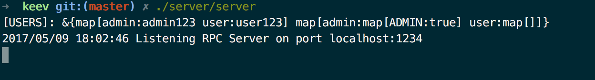
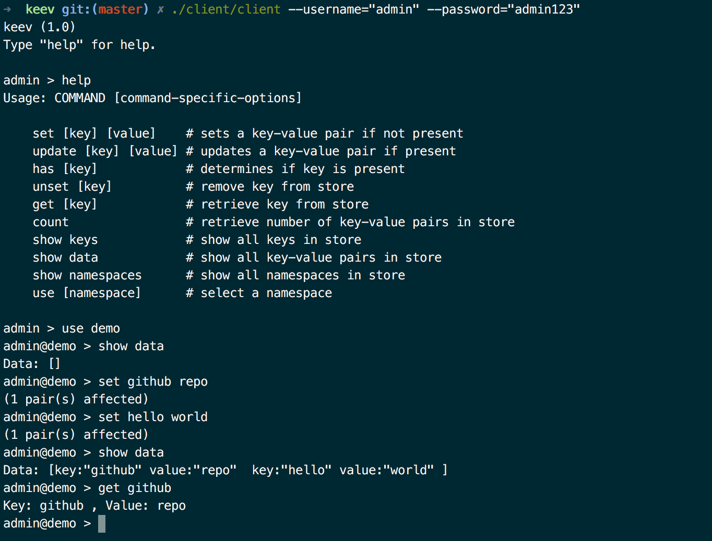

## keev

keev is a simple key-value store built on top of hash tables using Go. Clients communicate with the server using gRPC and Google Protocol Buffers (protobufs). Data persist to disk and saving occurs every 5 minutes.

## Architecture

High-level overview:

                 ┌ ─ ─ ─ ─ ─ ─ ─ ─ ─ ─ ─ ─ ─ ─ ─ ─ ─ ─ ─ ─ ─ ─ ─ ┐
                                      Clients
                 └ ─ ─ ─ ─ ─ ─ ─ ─ ─ ─ ─ ─ ─ ─ ─ ─ ─ ─ ─ ─ ─ ─ ─ ┘
                                        ▲
                                        │
                                        │ Google Protocol Buffers
                                        │
                                        ▼
                 ┌───────────────────────────────────────────────┐
                 │                    gRPC                       │
                 └───────────────────────────────────────────────┘
                 ┌───────────────────────────────────────────────┐
                 │                 RAM or disk                   │
                 └───────────────────────────────────────────────┘

Database current accepts the following commands:
- SET key value (valid if key is not present)
- UPDATE key value (valid if key is present)
- HAS key
- UNSET key
- GET key
- COUNT
- SHOW KEYS
- SHOW DATA
- SHOW NAMESPACES
- USE namespace

Restrictions:
* Both `key` and `value` cannot contain spaces.
* `key` cannot contain dots.
* Only alphanumeric characters are allowed for `namespace`

## Usage

1. Generate certificates for RPC: `go run generate_cert.go --host=localhost`

2. Change `JWTSigningToken` in `common/jwt.go`.

3. Define a list of users in `data/users.json`.
    Sample:
    ```json
    [
      {
        "username": "admin",
        "password": "admin123",
        "perms": ["ADMIN"]
      },
      {
        "username": "user",
        "password": "user123",
        "perms": []
      }
    ]
    ```

Server: `./server`
Client: `./client --username="user" --password="user123"`

## Program

### Server


### Client


## Future work?
- [ ] Permissions for users
- [ ] Tests
- [ ] Logs
- [ ] Own SQL-like syntax with lexer and parser
- [ ] Transactions
- [ ] Support for various types: numbers, etc.
- [ ] Drivers for other languages
- [ ] Scaling/fault-tolerant system using Raft/Paxos
